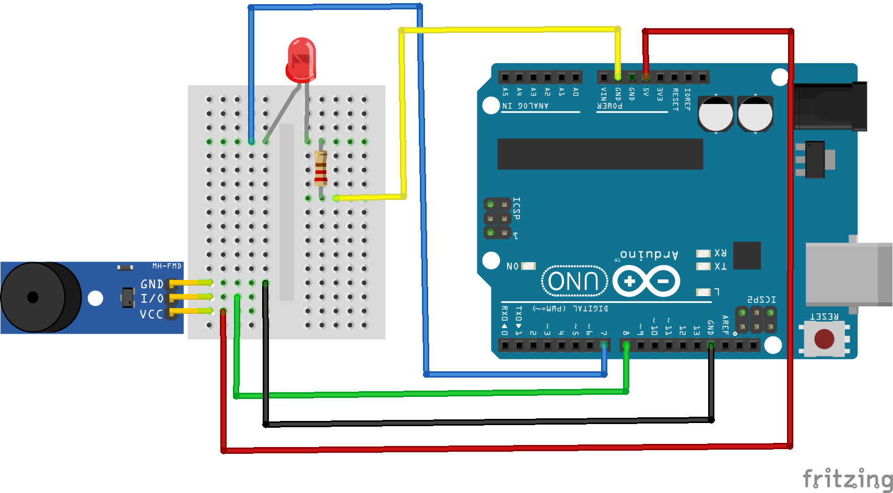
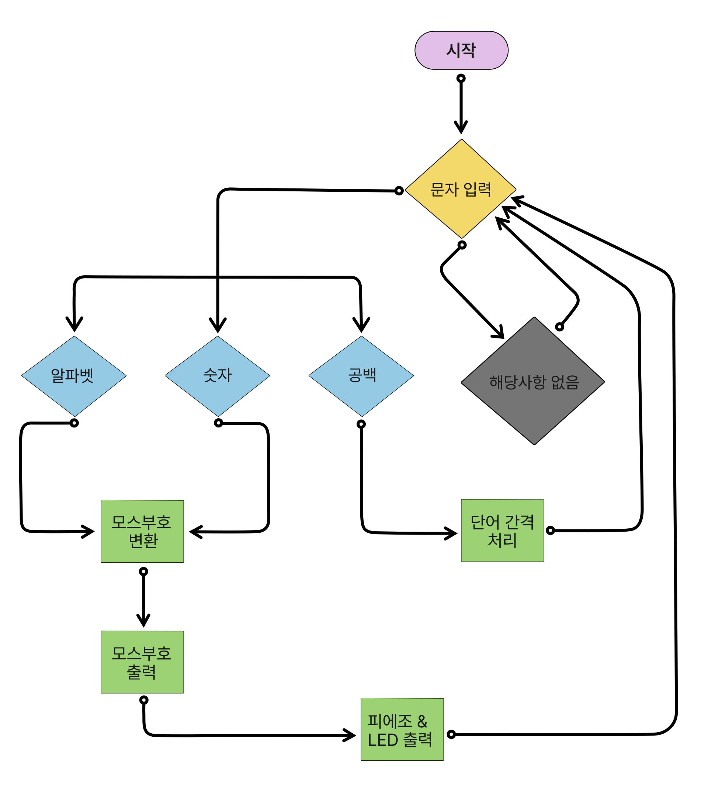

# 🎬 공학도서관 오리지널 컨텐츠

## 🔊 아두이노 모스 부호 생성기

## 📝 프로젝트 소개
이 프로젝트는 아두이노를 사용하여 텍스트를 모스 부호로 변환하고, LED와 부저를 통해 시각적/청각적 신호로 출력하는 장치를 만드는 과정을 설명합니다. 키보드로 입력한 문자를 자동으로 모스 부호로 변환하여 빛과 소리로 전달합니다.

## 📚 사전학습
이 프로젝트를 시작하기 전에 아래 내용을 먼저 공부하고 오시면 좋아요.

- 아두이노 기초
  - 아두이노 IDE 설치하기
  - 아두이노와 컴퓨터 연결하기
  - 기본 예제(Blink) 업로드해보기

- 전자부품 이해하기
  - LED 켜기/끄기 실습하기
  - 브레드보드 사용법 알아보기
  - 저항 색띠 읽는 법 배우기

- 프로그래밍 기초
  - 변수가 무엇인지 알아보기
  - 조건문(if) 사용해보기
  - 반복문(for, while) 이해하기

## 🎯 성취 목표
- 문자 'A'를 입력했을 때 도트(.) 한번과 대시(-) 한번이 정확하게 출력되는지 확인할 수 있다.
- 브레드보드에 LED와 부저를 올바른 위치에 배치하고 아두이노와 연결할 수 있다.
- 시리얼 모니터에 "HELLO"를 입력했을 때 LED의 깜박임과 부저의 소리가 동시에 발생하는지 테스트할 수 있다.
- 모스 부호의 시간 간격(도트 100ms, 대시 300ms)을 코드에서 찾아 수정할 수 있다.
- 회로 연결이 잘못되었을 때 발생할 수 있는 문제를 진단하고 해결할 수 있다.

## 🛠 준비물
- 아두이노 우노 보드
- USB Type A/B 케이블
- 브레드보드
- LED (빨간색)
- 220Ω 저항
- 피에조 부저 모듈
- 수수 점퍼선 5개
- 아두이노 IDE가 설치된 컴퓨터

## 📋 회로 연결 방법

### 피에조 부저 모듈 연결
| Arduino UNO | 부저 |
|------------|------|
| D8         | I/O  |
| 5V         | VCC  |
| GND        | GND  |

### LED 연결
| Arduino UNO | LED     |
|------------|---------|
| D7         | 양극(+) |
| GND        | 음극(-) |

> **주의**: LED 연결 시 220Ω 저항을 반드시 직렬로 연결하세요!

## 💾 실습 코드
| 파일명 | 설명 |
|--------|------|
| [morse_code.ino](./src/Morsecode_v0_2/Morsecode_v0_2.ino) | 모스 부호 생성기 기본 코드 |

## 💻 주요 함수 설명
1. `Sequence(char* sequence)`
   - 모스 부호 문자열을 받아서 LED와 부저로 출력
   - 점(.)과 대시(-)를 순차적으로 처리

2. `DotOrDash(char dotOrDash)`
   - 단일 신호(점 또는 대시) 출력 담당
   - LED 점등과 부저 소리를 동시에 제어
   
## ➡️ 순서도

1. 시리얼 모니도를 통해 문자 입력 받음
2. 입력된 문자를 모스 부호로 변환
3. 변환된 부호를 LED와 부저로 출력

## 🚀 시작하기
1. 회로를 제시된 도면대로 연결
2. 아두이노 IDE에서 코드 업로드
3. 시리얼 모니터 실행 (9600 baud)
4. 원하는 텍스트 입력하여 모스 부호 출력 확인

## 🔍 문제해결
- LED에 불이 들어오지 않아요
  - LED의 방향이 반대여서 안켜질 수도 있어요. LED의 긴 다리가 양극(+)이에요. 긴 다리가 아두이노 7번 핀에 연결되어 있는지 확인해보세요.
  - 저항이 LED와 제대로 연결되어 있지 않을 수 있어요. 저항 한쪽이 LED의 짧은 다리(음극)와 연결되어 있는지 확인해보세요.

- 부저에서 소리가 나지 않아요
  - 부저의 VCC와 GND가 바뀌어 있을 수 있어요. 빨간색 선이 5V에, 검은색 선이 GND에 연결되어 있는지 확인해보세요.
  - 부저의 신호선이 잘못 연결되어 있을 수 있어요. 노란색이나 흰색 선이 아두이노 8번 핀에 연결되어 있는지 살펴보세요.

- 모스 부호가 이상하게 나와요
  - 시리얼 모니터의 통신 속도가 다를 수 있어요. 오른쪽 아래 통신속도가 9600으로 설정되어 있는지 확인해보세요.
  - 대문자와 소문자를 구분해서 입력했는지 확인해보세요. 둘 다 동작하니 편한대로 입력하시면 됩니다.

## 🌟 이렇게 업그레이드 해볼 수 있어요
- LCD 화면을 달아서 내가 입력한 글자가 어떻게 변환되는지 볼 수 있어요. 
  예) A → .- 이렇게 표시해주면 더 재미있겠죠?

- 스마트폰으로도 글자를 보낼 수 있게 만들어볼까요? 
  블루투스 모듈을 연결하면 손쉽게 할 수 있어요.

- RGB LED로 바꿔서 신호마다 다른 색으로 표현해보면 어떨까요?
  도트(.)는 파란색, 대시(-)는 빨간색으로 하면 더 멋질 거예요.

- 버튼을 추가해서 모스 부호를 직접 입력할 수도 있어요.
  키보드 대신 버튼을 눌러서 도트(.)와 대시(-)를 만들어보세요.

- 피에조 부저 대신 작은 스피커를 연결하면 더 깔끔한 소리를 들을 수 있어요.
  다른 음색으로 바꿔보는 것도 재미있겠죠?

## 📚 참고 자료
- [모스 부호 위키백과](https://ko.wikipedia.org/wiki/%EB%AA%A8%EC%8A%A4_%EB%B6%80%ED%98%B8)
- [아두이노 내장 함수 ](https://www.arduino.cc/reference/en/)
